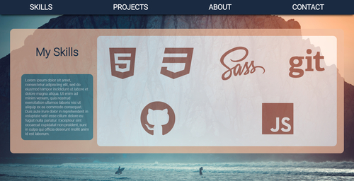

# About
This is the beginnings of my Portfolio project for the nology 12 week Software Development course.
This was made in the first few weeks after we had finished our first units on HTML, CSS, and JS. It's a very simple site, with a lot of placeholder information!

# Usage
Simply download the project files and open index.html in a browser window.

